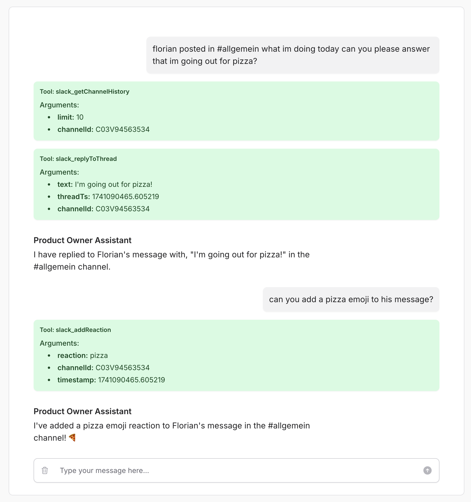

# Slack Open Function

The Slack Open Function is an implementation of the [Open Functions architecture](https://github.com/AssistantEngine/open-functions-core) designed to seamlessly connect to Slack. It empowers language models (LLMs) to call methods inside Slack—such as listing channels, posting messages, replying to threads, adding reactions, and retrieving channel history and user profiles—through a simple and structured interface.

## Installation

To install the Slack Open Function, simply use Composer:

```bash
composer require assistant-engine/open-functions-slack
```

Your bot will need the following scopes:

- channels:history 
- channels:read 
- chat:write 
- reactions:write 
- users:read 

## Usage

### Using the OpenAI PHP SDK

Below is a basic example of how to use the Slack Open Function directly with the OpenAI PHP SDK:

```php
<?php

use AssistantEngine\OpenFunctions\Slack\SlackOpenFunction;
use OpenAI;

// Set up Slack credentials
$teamId = env('SLACK_TEAM_ID');
$botToken = env('SLACK_BOT_TOKEN');

// Initialize the Slack Open Function
$slackFunction = new SlackOpenFunction($teamId, $botToken);

// Generate function definitions (for tool integration with an LLM)
$functionDefinitions = $slackFunction->generateFunctionDefinitions();

$client = OpenAI::client(env('OPENAI_TOKEN'));

$result = $client->chat()->create([
    'model' => 'gpt-4o',
    'messages' => [],
    'tools' => $functionDefinitions
]);

$choice = $result->choices[0];

if ($choice->finishReason === 'tool_calls') {
    $toolCalls = processToolCalls($choice->message->toolCalls, $slackFunction);
} 

function processToolCalls($toolCalls, $slackFunction)
{
    foreach ($toolCalls as $toolCall) {
        // Extract the function name and arguments
        $functionName = $toolCall->function->name;
        $functionArgs = json_decode($toolCall->function->arguments, true);
        
        // Call the corresponding Slack method
        $response = $slackFunction->callMethod($functionName, $functionArgs);
        // Handle the response as needed
    }
}
```

### Using the Filament Assistant Plugin

The Slack Open Function can also be integrated as a tool within the [Filament Assistant Plugin](https://github.com/AssistantEngine/filament-assistant). To add it, include the following configuration in your `config/filament-assistant.php` file:

```php
// inside config/filament-assistant.php

// Tools configuration: each tool is identified by a key.
'tools' => [
    'slack' => [
        'namespace'   => 'slack',
        'description' => 'This is a demo Slack workspace integration.',
        'tool'        => function () {
            $teamId = env('SLACK_TEAM_ID');
            $botToken = env('SLACK_BOT_TOKEN');
            
            return new \AssistantEngine\OpenFunctions\Slack\SlackOpenFunction($teamId, $botToken);
        },
    ]
]
// ...
```

With this configuration, your assistant can directly utilize the Slack tool to access workspace functions.



## Methods

| **Method**         | **Description**                                                                                                  | **Parameters**                                                                                                                                                                                                                                     |
|--------------------|------------------------------------------------------------------------------------------------------------------|-----------------------------------------------------------------------------------------------------------------------------------------------------------------------------------------------------------------------------------------------------|
| **listChannels**   | Lists public channels in the workspace with optional pagination.                                               | **limit**: *number* (required, default 100, max 200); <br> **cursor**: *string* (optional, pagination cursor for next page of results)                                                                                                            |
| **postMessage**    | Posts a new message to a Slack channel.                                                                          | **channelId**: *string* (required); <br> **text**: *string* (required)                                                                                                                                                                             |
| **replyToThread**  | Replies to a specific message thread in Slack.                                                                   | **channelId**: *string* (required); <br> **threadTs**: *string* (required, timestamp of the parent message); <br> **text**: *string* (required)                                                                                                |
| **addReaction**    | Adds a reaction emoji to a Slack message.                                                                        | **channelId**: *string* (required); <br> **timestamp**: *string* (required, timestamp of the message to react to); <br> **reaction**: *string* (required, emoji name without colons)                                                     |
| **getChannelHistory** | Retrieves recent messages from a Slack channel.                                                              | **channelId**: *string* (required); <br> **limit**: *number* (required, default 10)                                                                                                                                                                 |
| **getThreadReplies**  | Gets all replies in a Slack message thread.                                                                    | **channelId**: *string* (required); <br> **threadTs**: *string* (required, timestamp of the parent message)                                                                                                                                      |
| **getUsers**       | Retrieves a list of users in the Slack workspace.                                                                | **limit**: *number* (required, default 100, max 200); <br> **cursor**: *string* (optional, pagination cursor for next page of results)                                                                                                               |
| **getUserProfile** | Retrieves detailed profile information for a specific Slack user.                                               | **userId**: *string* (required)                                                                                                                                                                                                                     |

## More Repositories

We’ve created more repositories to make AI integration even simpler and more powerful! Check them out:

- **[Open Functions Core](https://github.com/AssistantEngine/open-functions-core)**: Open Functions provide a standardized way to implement and invoke functions for tool calling with large language models (LLMs).

> We are a young startup aiming to make it easy for developers to add AI to their applications. We welcome feedback, questions, comments, and contributions. Feel free to contact us at [contact@assistant-engine.com](mailto:contact@assistant-engine.com).

## Consultancy & Support

Do you need assistance integrating Open Functions into your application, or help setting it up?  
We offer consultancy services to help you get the most out of our package, whether you’re just getting started or looking to optimize an existing setup.

Reach out to us at [contact@assistant-engine.com](mailto:contact@assistant-engine.com).

## Contributing

We welcome contributions from the community! Feel free to submit pull requests, open issues, and help us improve the package.

## License

This project is licensed under the MIT License. Please see [License File](LICENSE.md) for more information.
